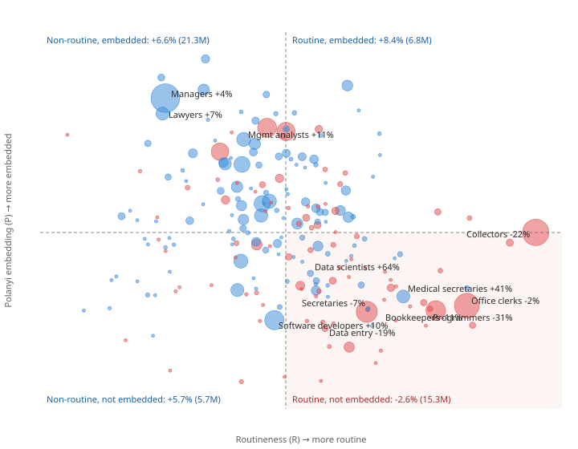
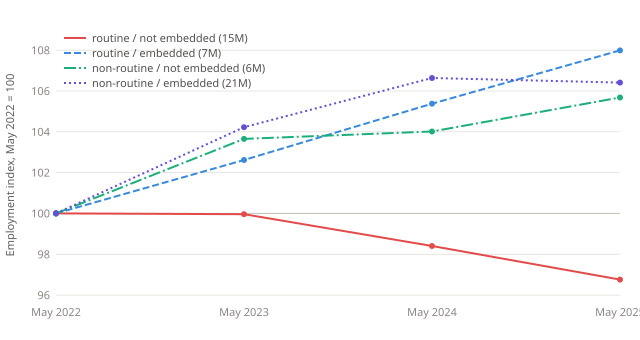

# Routine Went First. Judgment Is Next.

The BLS occupation data I promised in March is out. Fifteen million routine, non-embedded jobs shrank while every other kind of knowledge work grew. Now the leading indicators are pointing up the ladder.

Ben · September 2026 · 11 min read

In March I published a model of AI worker displacement built on a single idea: AI is offshoring on steroids, so the jobs that go are the ones where the work can be packaged up and handed to something that isn't in the room. I called the resistance to that Delegation Resistance, scored 894 occupations on it, and showed it predicted which sectors were losing job postings.

I also wrote this: *"The real test comes when BLS releases occupation-level employment counts for 2025."*

That data landed in May. And last week Tyler Cowen posted a simple two-factor model of AI-aided growth that makes a different prediction about who loses. So I did what I should: I wrote down both models' predictions, then pulled the employment data for every teleworkable occupation in the country, 2022 through 2025, and scored them.

The short version: my model got the protective side right and the displaced side wrong. Cowen's model got the protective side right and the displaced side wrong in the *other* direction. The data point at something neither model wrote down. And software developers, whom my March post flagged as high-risk, grew 10%.

The rest of this post explains that chart. If you came for the correction about software developers, it's in the next section.

• • •

## What I Got Wrong in March

Three things, in decreasing order of embarrassment.

**Software developers.** Delegation Resistance scored them as highly exposed: screen-based, structured inputs, verifiable outputs. Between May 2022 and May 2025, software developer employment rose 10%, from 1.53 million to 1.69 million. Computer programmers, a separate occupation that means "writes code to spec," fell 30%. QA testers fell 5%. Web developers fell 21%. My metric put all four in the same bucket because it scores how easily work can be handed off, and all four hand off equally well. What separated them was something DR didn't measure: whether the job is deciding what to build or executing what was decided.

**The anchorless list.** I identified 29 occupations with no task that anchors them to a human and implied they were the most exposed. Some were: data entry keyers −19%, billing clerks −9%, web developers −21%. But market research analysts, the largest occupation on that list, grew 13%. Economists grew 9%, physicists 8%. Having no physical anchor turned out to be necessary for displacement but nowhere near sufficient.

**The mechanism.** My model's central claim was that AI would first hit jobs that couldn't be offshored because they needed real-time interaction: customer-facing, high-contact, communication-bound work. Once I built the proper communication-friction index from O*NET and ran it against employment change, it had no effect. Zero, in every specification. High-contact occupations (managers, sales managers, HR) grew. What I had called communication friction correlates 0.47 with something else, and that something else protects rather than exposes.

I don't want to bury that. The idea that made the March post interesting, "AI as offshoring on steroids," predicted the wrong first casualties.

• • •

## Cowen's Model

Cowen's post proposes two factors. Intelligence is formal reasoning, and AI is about to flood the supply of it. Polanyi knowledge is everything tacit and situated: how this office works, what this client wants, when to make the call. The two are complements, so when Intelligence gets cheap, Polanyi knowledge becomes the scarce input and its price rises.

That's an aggregate model, but it has an occupation-level implication if you treat each job as a bundle of the two factors: high-Intelligence, low-Polanyi occupations lose; high-Polanyi occupations gain. I built both scores from O*NET items I hadn't used in March,[†](#fn-scores) so the two models would draw on different data, and wrote the predictions down before looking at outcomes.

• • •

## The Data

BLS Occupational Employment and Wage Statistics, May 2022 through May 2025, for every occupation that Dingel and Neiman classify as teleworkable, plus computer occupations, with at least 10,000 workers. That's 218 occupations and 49 million people. The baseline is +5.1% employment for all occupations over the same three years.

Two indices from my March model (communication friction, verification friction), two from Cowen's (Intelligence, Polanyi), plus the AI Occupational Exposure index that most of the "AI and jobs" literature uses.[‡](#fn-data)

## What Predicted Nothing

Start with the null result, because it's the one I'm most confident in.

**AI exposure, as measured by AIOE, does not predict which occupations shrank.** Not alone, not with controls, not within the office-and-administrative group where every occupation is highly exposed. The coefficient is indistinguishable from zero in every specification I ran. The most-exposed third of occupations did *better* than the middle third. This is the central finding of my March model, that exposure is not displacement, and it now stands on employment data rather than postings.

**My quadrants didn't predict either.** Sorting occupations by communication friction and verification friction gives four groups. The one I said would be hit first grew 3.3%. The one I said was already hollowed out by offshoring shrank 0.5%. The one high on both frictions grew 8.6%. The protected corner is real. The exposed corner isn't where I put it.

**Cowen's Intelligence factor has the wrong sign.** High-Intelligence occupations grew: management analysts +11%, financial managers +14%, civil engineers +20%, data scientists +64%. The Intelligence score has a positive coefficient in every regression. If AI were flooding the supply of reasoning and displacing the people who supply it, this is not what the first three years would look like.

• • •

## What Did Predict: Routine × Embedded

The occupations that shrank share two things. They're routine, and they're not embedded in a place, an institution, or a relationship.

I measured routineness with three O*NET items: importance of repeating the same tasks, freedom to make decisions (reversed), and freedom to set your own priorities (reversed).[§](#fn-routine) Embeddedness is Cowen's Polanyi score: on-site training required, social perceptiveness, negotiation, relationship-building, physical proximity.

Split both at the median and you get four cells:

| May 2022 → May 2025 | Not embedded | Embedded |
|---|---|---|
| **Routine** | **−2.6%** (15.3M workers) | +8.4% (6.8M) |
| **Non-routine** | +5.7% (5.7M) | +6.6% (21.3M) |

One cell shrank. Every other cell grew 6–8%, faster than the economy. The routine-and-not-embedded cell holds customer service reps (−284,000 jobs), bookkeepers (−177,000), secretaries (−120,000), office clerks, collectors, order clerks, data entry keyers, programmers, credit analysts. Fifteen million people, and the only group of knowledge workers that lost ground.

Neither factor does this alone. Routine work that *is* embedded grew 8.4%. The cleanest pair in the whole dataset: secretaries and administrative assistants, −6.6%. Medical secretaries, +40.9%. Same task list, same O*NET skill profile, opposite outcome, because one of them sits next to patients and clinicians and the other doesn't.

In a regression with all three factors, routineness alone carries the full-period result. But in 2024→25 specifically, the interaction term (routine × embedded) is the most statistically significant thing in the data, larger than in either earlier year. That's the closest thing to an AI-era signature I found: the routine cell was already declining before ChatGPT, and the gap between routine-not-embedded and everything else widened in the most recent year rather than closing.[¶](#fn-caveats)

• • •

## Reading Both Models Against This

Cowen's mechanism survives. A scarce complement gains when its partner floods in. But the factor that flooded wasn't Intelligence in the reasoning-and-judgment sense; it was routine information processing, which his model folds into Intelligence and can't see separately. His model can't distinguish a credit analyst from a bill collector, and they went opposite ways.

My mechanism partly survives. Verification friction was weakly protective, and it turns out to have been a proxy for non-routineness. Communication friction was a proxy for Polanyi embedding, mislabeled as exposure when it's protection. The offshoring analogy pointed at the wrong first casualties because offshoring was constrained by communication and AI isn't.

What both models missed is that the seam runs *inside* task categories, not between them. "Secretary" is not a unit. The O*NET Polanyi scores for medical secretaries and other secretaries are nearly identical; the sector did the protecting. Any model that scores occupations without scoring where they sit will get medical secretaries wrong, and both of ours did.

• • •

## Is the Intelligence Wave Next?

Cowen would say the reasoning-heavy occupations are simply later in the queue. There's some early support for that, and it comes from the same Indeed postings data I used in March.

Postings for routine categories have stopped falling. Customer service is flat since January 2025; administrative assistance tracks the aggregate. Both sit well below pre-pandemic, which is consistent with the employment data: the routine wave happened in 2022–24 and is now at trend.

Accounting postings are down 27% since January 2025, the largest decline of any Indeed category. Accountants grew 3.4% in the employment data through May 2025. So the hiring margin in a high-Intelligence, high-verification occupation is turning before the headcount does. That's the profile Cowen's model predicts.

Against that: software development postings are *up* 10% since January, and every engineering category rose. Legal and math track the aggregate. One category is not a wave.

The employment data show something similar at the top. The non-routine, embedded cell, which grew 4.2% in 2022→23, grew 2.3% in 2023→24 and −0.2% in 2024→25. Management occupations went from +6.4% a year to +1.0%. That's not displacement of incumbents. It reads as a hiring stall, and industry reports on insurance adjusters (junior postings down ~50%, senior roles holding) suggest it's concentrated at the entry level. Neither model has a hiring-margin mechanism. Both should.

• • •

## What I'd Bet On

If I had to state the model now, it has three factors, not two:

- **Routine cognitive work.** What AI substitutes. Steadily, since before ChatGPT, accelerating since.
- **Reasoning and judgment.** What AI has so far complemented. Possibly next; accounting postings are the first hint.
- **Polanyi embedding.** What AI can't reach. Protective on its own and, more importantly, protective of routine work that happens inside it.

And one interaction: routine work is displaced only where it isn't embedded. That's Cowen's complementarity claim, but between routine and Polanyi rather than Intelligence and Polanyi.

The next data point is May 2026 OEWS, out next spring. If the routine × embedded interaction weakens, 2025 was noise. If high-Intelligence occupations turn negative, Cowen was right about the sequence even though routine went first. If accounting employment follows accounting postings, both.

• • •

## Data and Code

The 218-occupation panel with all indices, the scripts that build it, and checkpoint tests are in the [followup directory](https://github.com/jbgh2/ai-worker-displacement/tree/main/followup) of the repo. Occupation employment: [BLS OEWS](https://www.bls.gov/oes/tables.htm), May 2022–2025. Occupation attributes: [O*NET 30.0](https://www.onetcenter.org/database.html). Teleworkability: [Dingel and Neiman (2020)](https://github.com/jdingel/DingelNeiman-workathome). AI exposure: AIOE, Felten, Raj and Seamans (2021). Job postings: [Indeed Hiring Lab](https://hiringlab.indeed.com/data/) via FRED, through September 4, 2026.

### Methodology Notes

[†](#fnref-scores) **Cowen's factors.** Intelligence: O*NET Abilities importance for deductive reasoning, inductive reasoning, mathematical reasoning, information ordering, written comprehension, written expression, plus Work Activities analyzing and processing information. Polanyi: required on-site and on-the-job training (Education/Training file), social perceptiveness, coordination, persuasion, negotiation (Skills), establishing relationships, resolving conflicts, guiding subordinates (Work Activities), physical proximity (Work Context). Each item z-scored across the sample, then averaged. No overlap with the March DR items or the friction indices.

[‡](#fnref-data) **Data assembly.** BLS blocks bulk downloads from scripts, so 2022–2024 OEWS came from a GitHub mirror, validated against the BLS API for 2025 and against BLS profile pages for 50 occupations (zero mismatches). The analysis was developed with Claude in a single session, with predictions written to a log before each data pull, then re-implemented as the scripts in the repo; the scripts' numbers are the ones here. Sample: Dingel-Neiman teleworkable = 1, plus all SOC 15 computer occupations (Dingel-Neiman uses 2010 codes there), 2022 employment ≥ 10,000. Accountants are not classified teleworkable and sit outside the 218; their +3.4% comes from the BLS API directly.

[§](#fnref-routine) **A confession about the routine index.** I did not have it written down before the first regressions. I built it after seeing that the losers spanned all four of my quadrants and shared low scores on both Intelligence and Polanyi, and I logged its definition before running it. That makes it a specification search, not a pre-registered test. Two things make me less worried than I should be: the items are standard Autor-Levy-Murnane routine-task proxies, and the result is driven by the interaction with Polanyi, which *was* pre-specified. But you should discount accordingly.

[¶](#fnref-caveats) **Three caveats that constrain everything above.** OEWS pools three years of survey panels, so each annual estimate is smoothed toward earlier years; BLS says not to use it as a time series, and I did anyway, again. Accelerations are understated as a result. Second, I have no 2019 baseline yet; bookkeepers and data entry keyers were declining before 2022 from ordinary software, and a difference-in-differences against 2019→2022 is needed before attributing the routine decline to AI rather than to a trend it joined. Third, the rate cycle confounds loan officers, loan interviewers and credit clerks; excluding them doesn't change the four-cell result. The medical-secretaries comparison is also entangled with health care demand, which grew regardless of AI.
